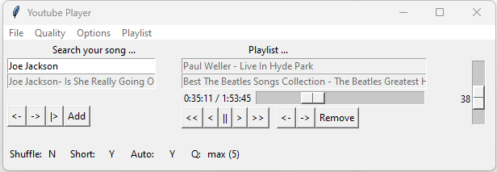

# YouTube player

Inspired by Willem van Houten through StackExchange [Code Review](https://codereview.stackexchange.com/questions/282051/a-gui-youtube-audio-player/282196#282196) a straightforward Youtube player.

Tested for Python 3.11
Requirements are in the file `requirements.txt`

